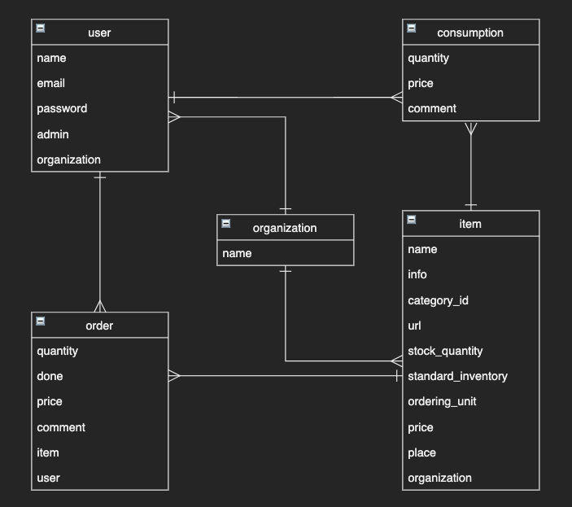

# 名前
STOCK

# 概要
会社、個人で使える消耗品の管理サイトです。

# URL

# テストアカウント
### Basic認証
* 🆔: admin
* password: 2222
### 組織アカウント
* name: 株式会社STOCK
* password: qqq111
### ユーザーアカウント
* email: sample@sample.com
* password: qqq111

# 使用方法
* 組織
  * 登録
  * ログイン
  * 編集
* ユーザー
  * 登録
  * ログイン
  * 一覧
  * 編集
  * 削除
  * 管理者権限管理
* 消耗品
  * 登録
  * ログイン
  * 編集
  * 消耗品
  * 登録
  * 一覧
  * 詳細
  * 削除
  * 使用記録
  * 入庫記録
  * 検索
  * カテゴリー分け
  * 使用分析(組織全体、ユーザー毎)

# 目指した課題解決
前職で消耗品の管理を経験し、多くの時間、手間がかかるとわかりました。
効率的な消耗品の管理ができるよう作成しました。
### 消耗品の在庫の可視化
全ての消耗品の在庫を目視で確認するのは手間と時間がかかるため、
計算上の在庫数を一覧で確認できるようにしました。

### 消耗品の使用状況の可視化
消耗品の使用について、使用者が入力することで管理者がのちに確認できるようにしました。

### 消耗品の管理場所の共有
消耗品がどこに保管されているのか単品毎にわかるようにしました。

### 発注の簡易化(一元管理)
単品毎に消耗品のURLを記載できるようにしました。

# 洗い出した要件
* 

# 実装した機能についてのGIFと説明

# 実装予定の機能
* 組織登録機能
* 組織ログイン機能
* ユーザー登録機能
* ユーザーログイン機能
* ユーザー編集機能
* ユーザー削除機能
* 消耗品登録機能
* 消耗品の詳細機能
* 消耗品の削除機能
* 消耗品の在庫登録機能
* 消耗品の使用記録機能
* ユーザー権限機能
* 消耗品の検索機能
* 消耗品のグループ分けまたはタグ付
* 消耗品の使用分析機能

# データベース設計

# テーブル設計

## organizations テーブル

| Column             | Type    | Options     |
| ------------------ | ------- | ----------- |
| name               | string  | null: false |

### Association

- has_many :users
- has_many :items

## users テーブル

| Column             | Type       | Options                        |
| ------------------ | ---------- | ------------------------------ |
| name               | string     | null: false                    |
| email              | string     | null: false                    |
| password           | string     | null: false                    |
| admin              | boolean    | null: false                    |
| organization       | references | null: false, foreign_key: true |

### Association

- has_many :orders
- has_many :consumptions
- belongs_to :organization

## items テーブル

| Column                 | Type       | Options                        |
| ---------------------- | ---------- | ------------------------------ |
| name                   | string     | null: false                    |
| info                   | text       |                                |
| category_id            | integer    | null: false                    |
| url                    | text       | null: false                    |
| stock_quantity         | integer    | null: false                    |
| standard_inventory     | integer    | null: false                    |
| ordering_unit          | integer    | null: false                    |
| price                  | integer    | null: false                    |
| place                  | string     | null: false                    |
| organization           | references | null: false, foreign_key: true |

### Association

- belongs_to :organization
- has_many :consumptions
- has_many :orders

## orders テーブル

| Column              | Type       | Options                        |
| ------------------- | ---------- | ------------------------------ |
| quantity            | integer    | null: false                    |
| done                | boolean    | null: false                    |
| price               | integer    | null: false                    |
| comment             | text       |                                |
| item                | references | null: false, foreign_key: true |
| user                | references | null: false, foreign_key: true |

### Association

- belongs_to :user
- belongs_to :item

## consumptions テーブル

| Column              | Type       | Options                        |
| ------------------- | ---------- | ------------------------------ |
| quantity            | integer    | null: false                    |
| price               | integer    | null: false                    |
| comment             | text       | null: false                    |
| item                | references | null: false, foreign_key: true |
| user                | references | null: false, foreign_key: true |

### Association

- belongs_to :user
- belongs_to :item

# ローカルでの動作方法

